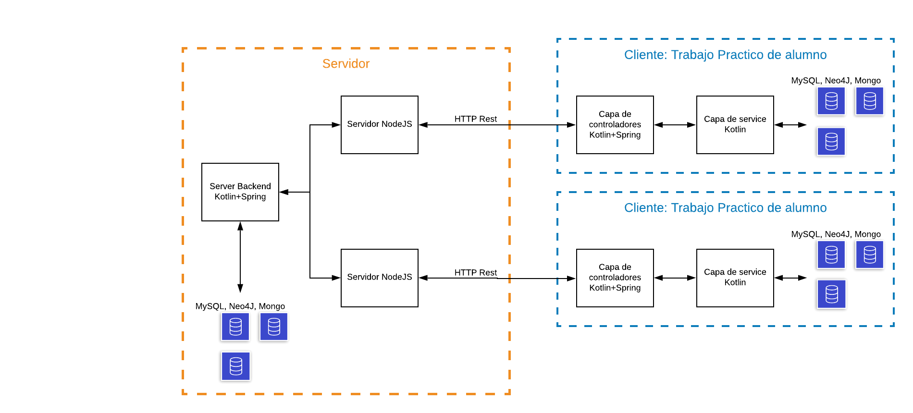

  

## Proposito

Durante la cursada de la materia 'Estrategias de Persistencia' en la universidad de Quilmes, se les presenta a los alumnos un trabajo practico de varias iteraciones a resolver.
Este trabajo practico consta de un enunciado en el que se presentan las interfaces de multiples servicios, y los alumnos dan practica a la teoria de la materia, haciendo
implementacion de estos servicios que interactuan tanto con la capa de modelo de la aplicacion como la capa de persistencia.

Sin embargo, una problematica recurrente es la dificultad de comprension por parte de los alumnos de como encajaria el trabajo que estan haciendo dentro de una aplicacion de uso real.

Con Eperdemic nos proponemos darle una solucion a esa problematica, dando realmente un uso real a esos trabajos practicos; proveyendo un servidor con una capa de presentacion real,
a la cual los alumnos pueden conectarse desde sus computadoras con sus trabajos practicos, ver como el flujo de datos llega hasta el service que estuvieron trabajando para implementar, 
y tambien ver como los datos que estan manejando en sus TPs interactuan con los datos que otros alumnos estan manejando en sus otros TPS al estar conectados al mismo servidor.

## Arquitectura 

  

La aplicacion esta dividida en dos grandes partes, una parte de clientes y una de servidor.
A grandes rasgos,  los clientes estan conformados por los trabajos practicos de los alumnos, a los cuales ya se les provee un proyecto con la capa de controladores armada, lista para
interactuar con la capa de servicios y recibir informacion del servidor. 

Recordemos que la capa de servicios y las bases de datos no estarian implementadas, ya que es el trabajo que deberian realizar los alumnos para completar sus trabajos practicos.  
Sin embargo, una vez completada su implementacion, los controladores ya estarian listos para que se pueda llevar a cabo la coneccion e interaccion con el servidor principal.

Cuando se corre el proyecto, este realizaria un pedido de subscripcion al servidor, para poder comenzar con la interaccion entre ambas partes.

El servidor recibe este pedido, y asignaria un identificador al cliente, de tal manera que cada cliente pueda acceder y realizar pedidos a su propio backend.
Asi mismo, el servidor tendria un area publica en la cual se mostrarian datos de todos los clientes, y de necesitarse se podrian realizar operaciones que impacten sobre todos los clientes tambien.

Por ultimo, el servidor de querer realizar operaciones con todos los datos de los clientes, o de necesitar realizar permutaciones de datos mas complejas, contaria con su propio backend, con el cual podria interactuar
y llevar a cabo esas operaciones.

## Repositorios
Actualmente existen 3 repositorios distintos

Cliente
Existen dos repositorios de cliente, uno publico y otro privado de pruebas. Nos hace falta tener otro repositorio privado de pruebas, ya que para testear que el servidor se comporta
como esperamos, necesitamos implementar los trabajos practicos nosotros y ver que las pruebas de integracion son exitosas. Obviamente, de ser publico este repositorio los alumnos 
podrian copiarse y eso derrotaria la razon de ser del trabajo practico.

Repositorio de cliente publico:
https://github.com/fedes112/EPERdemic_Controllers

Repositorio de cliente privado y de pruebas:
https://github.com/EPERS-UNQ/TP_EPERDEMIC

Repositorio de servidor
https://github.com/fedes112/EPERdemic_Frontend

## Tecnologias - Fede

-React: para el desarrollo del frontend utilizamos React (biblioteca escrita en JavaScript), facilita la creación de componentes interactivos y reutilizables.
-Spring: Como framework para el desarrollo de la aplicación por todas las herramientas que disponibiliza para facilitar el "cableado" entre las capas de servicios y controllers, simplificación de syntaxis y orquestado de la arquitectura backend.
-Kotlin: Utilizamos Kotlin como el lenguaje de nuestro backend por su flexibilidad como lenguaje, su integración con Spring y por estar montado sobre la JVM (siendo Java un lenguaje al que estamos acostumbrados).
-SQL Server: A priori utilizamos como Base de Datos SQL Server tal y como hacemos en la mayoria de los casos en la materia Estrategias de Persistencia (podriamos por ej variar y usar MariaDB, Postgres, etc).
-NodeJs : El servidor web estara montado sobre nodejs sobre su compatibilidad con proyectos react, su amplia documentación y la gran mayoria de los problemas recurrentes ya se encuentran resueltos.

## CI - Ivar

## Casos de uso - Fede

  

Como Usuario quiero poder crear un agente patógeno.

Como Usuario quiero poder recuperar todos los agentes patógenos y poder ver tanto los creados por mi, como los creados por los otros usuarios.  

## Conectividad Servidor - Cliente - TODO

## Deployment - TODO

## TODO Actualizar Trello
