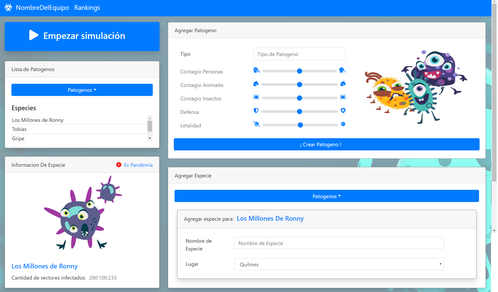

# Entrega 1

## Funcionalidades

Nuestro objetivo para la entrega 1 fue armar el esqueleto real de la aplicación.
Qué queremos decir con esto? Para la prueba de concepto no nos preocupamos por una buena visualización de la aplicación, user experience, e incluso el backend al estar
implementado en JDBC el setup del proyecto fue bastante sencillo. Pero para esta entrega, había que hacerse cargo de presentar a los diferentes grupos de alumnos en Estrategias de Persistencia
El TP 2 listo para que comiencen con su implementación.

Planteada esta problemática, nuestro foco para esta entrega fue:
	* Definir TP 2 (Hibernate) de Persistencia. Pensarlo de tal forma que se pueda utilizar ese TP como principal mecanismo de empuje para la simulación visualizada en el front end.
    * Implementar toda la capa de controladores y de Spring sumado a Hibernate, asegurándonos que ambas funcionen sin pisarse entre sí. 
	* Hacer un mockup del front, de tal manera que se pueda ver cómo se terminara visualizando el juego
	* Adaptar los primeros casos de uso a todos estos cambios nuevos

## Capa de presentacion Entrega 1

  

## Casos de uso

Si bien los casos de uso se mantuvieron como los mismos, cambiaron los requerimientos de estos. Decidimos también enfocarnos primero en la experiencia "single player" primero, antes
de hacer el onboarding de funcionalidades globales.

  

`Como Usuario quiero poder crear un agente patógeno.`

El Agente patógeno debe tener un nombre, y debe de ser posible configurar sus atributos.
De ser Exitosa la creación del patógeno, se debería ver un feedback de que lo fue, de no serlo, deberá haber un feedback de ese error.

`Como Usuario quiero poder recuperar todos los agentes patógenos creados por mi`

Se recuperan todos los agentes patógenos persistidos en el backend y se le muestran al usuario. Si por alguna razón no se puede realizar esta recuperación, dar feedback al usuario.

