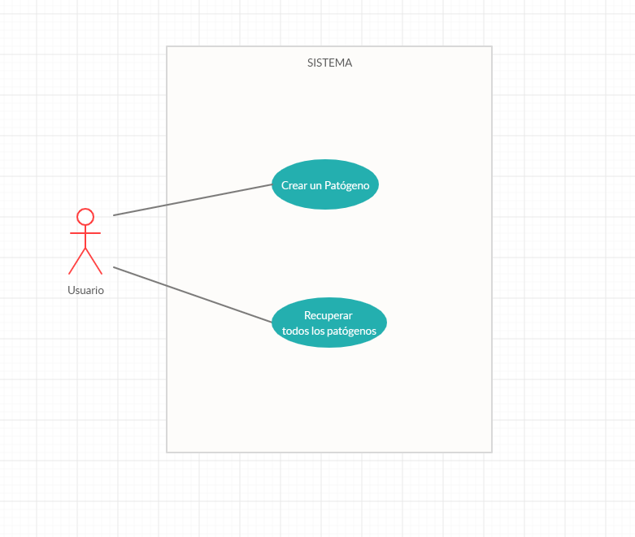

# Entrega 1

## Funcionalidades

Nuestro objetivo para la entrega 1 fue armar el esqueleto real de la aplicacion.
Que queremos decir con esto? Para la prueba de concepto no nos preocupamos por una buena visualizacion de la aplicacion, user experience, e incluso el backend al estar
implementado en JDBC el setup del proyecto fue bastante sencillo. Pero para esta entrega, habia que hacerse cargo de presentar a los diferentes grupos de alumnos en Estrategias de Persistenciaa
El TP 2 listo para que comiencen con su implementacion.

Planteada esta problematica, nuestro foco para esta entrega fue:
	* Definir TP 2 (Hibernate) de Persistencia. Pensarlo de tal forma que se pueda utilizar ese TP como principal mecanismo de empuje para la simulacion visualizada en el front end.
    * Implementar toda la capa de controladores y de Spring sumado a Hibernate, asegurandonos que ambas funcionen sin pisarse entre si. 
	* Hacer un mockup del front, de tal manera que se pueda ver como se terminara visualizando el juego
	* Adaptar los primeros casos de uso a todos estos cambios nuevos

## Casos de uso

Si bien los casos de uso se mantuvieron como los mismos, cambiaron los requerimientos de estos. Decidimos tambien enfocarnos primero en la experiencia "single player" primero, antes
de hacer el onboarding de funcionalidades globales.

  

`Como Usuario quiero poder crear un agente patógeno.`

El Agente patogeno debera tener un nombre, y debe de ser posible configurar sus atributos.
De ser Exitosa la creacion del patogeno, se debera ver un feedback de que lo fue, de no serlo, debera haber un feedback de ese error.

`Como Usuario quiero poder recuperar todos los agentes patógenos creados por mi`

Se recuperan todos los agentes patogenos persistidos en el backend y se le muestran al usuario. Si por alguna razon no se puede realizar esta recuperacion, dar feedback al usuario.

