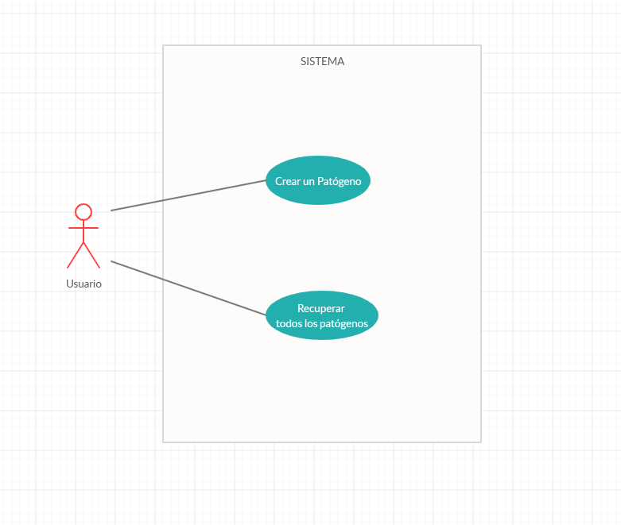

# Entrega 2

## Funcionalidades

La meta para la entrega 2 era tener una primera versión del simulador andando. Qué queremos decir con esto? Poder tener algo que juegue y
simule efectivamente el enunciado planteado.

Para poder realizar esto, necesitamos:

- Crear y visualizar las especies
- Crear en el backend ubicaciones que tengan vectores que nos permitan contagiar las diferentes especies de patógenos que vamos creando 
- Un mecanismo para que estas se vayan esparciendo a través de las locaciones y los vectores en ellas.

Cómo se contagian los vectores y se expanden las especies patogenas? Hay dos formas. 

### Expansion
Dada una locacion, este pedido de expansión toma un vector infectado random en esa locacion, e intenta contagiar a todos los otros vectores presentes en  esa misma locación.

### Movimiento
Cuando un vector se mueve a otro lugar, este intenta contagiar a todos los vectores presentes en su nueva locación.

Y para que la simulacion se de, desde el front se hacen pedidos al backend para que se tomen vectores random, se muevan a lugares random (para poder ir esparciendo la especie patógena a otras locaciones), y tambien se hacen pedidos para "expandir" en todas las locaciones.

## Capa de presentacion Entrega 1

  

## Casos de uso

  

`Como Usuario quiero poder crear un agente patógeno.`

El Agente patógeno deberá tener un nombre, y debe de ser posible configurar sus atributos.
De ser Exitosa la creación del patógeno, se debería ver un feedback de que lo fue, de no serlo, deberá haber un feedback de ese error.

`Como Usuario quiero poder recuperar todos los agentes patógenos creados por mi`

Se recuperan todos los agentes patógenos persistidos en el backend y se le muestran al usuario. Si por alguna razón no se puede realizar esta recuperación, dar feedback al usuario.

`Como Usuario quiero poder crear una especie para un Patógeno en una ubicación elegida`
Se debe poder seleccionar un patógeno, mostrar y seleccionar uno de las múltiples locaciones disponibles, y enviar un pedido de creación de la especie para el patógeno seleccionado al cliente backend.
De ser exitoso o no, se debe poder mostrar un feedback al usuario.
Cuando se crea una especie en la ubicación seleccionada, se toma un vector random y se lo mueve a una locación random.

`Como Usuario quiero poder ver la información de las especies creadas para un patógeno`
Dada una lista de patógenos, se debe poder visualizar todas las especies pertenecientes a ese patógeno, y ver también su información

`Como Sistema quiero poder tomar un vector random y moverlo a una ubicación random en un intervalo dado`
De esta manera, los vectores infectados pueden empezar a exparsise a través de las diferentes locaciones.

`Como Sistema quiero poder hacer un pedido de expansión masiva al backend`
De esta manera, los vectores infectados en cada locación comienzan a expandir sus infecciones.

