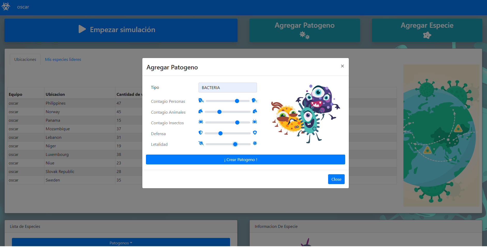
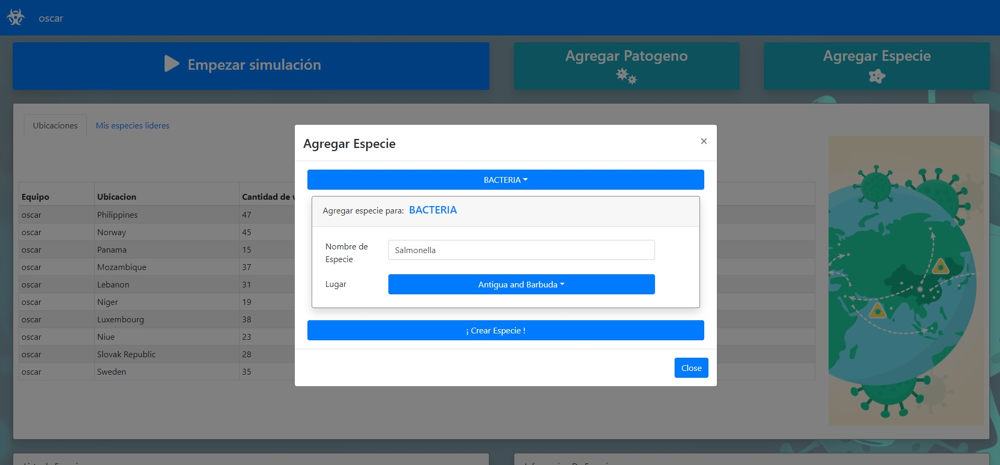
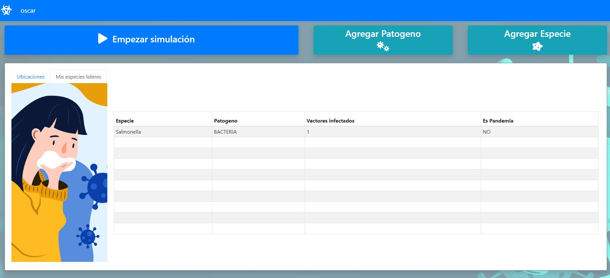

# Entrega 3

## Funcionalidades

Metas para la Entrega 3, muchos cambios a nivel UEX:

- Al momento de seleccionar, tanto patógenos como lugares, que se mantenga el item seleccionado en la visor.
- Al momento de querer ver las especies de un patógeno, que las muestre automáticamente cuando se clickea sobre un patógeno.
- Los botones de Agregar patógeno y Agregar especie pasar a desplegar modals con sus respectivos forms.

Como también nuevos features:

- Un leaderboard que muetren las especies lideres del equipo actual
- Un leaderboard que muestre los lugares más infectados, con el detalle, de que visualiza los lugares de todos los grupos.

La data para el leaderboard con las especies lideres se consigue a partir de llamadas a servicios en el backend:

### Lideres

Retorna las diez primeras especies que hayan infecatado la mayor cantidad total de vectores humanos y animales combinados en orden descendente.

### Es pandemia

Devuelve true si la especie se encuentra presente más de la mitad de todas las locaciones disponibles.

### Cantidad Infectados

Devuelve la cantidad de vectores infectados por la especie.

La data para el leaderboard con los lugares más infectados se consige a partir de llamadas a:

### Reportes de Contagio

Dada una ubicacion, debera retornar un objeto reporte que contenga

- La cantidad de vectores presentes.
- Cantidad de vectores infectados.
- Nombre de la especie que esta infectando a mas vectores.

## Capa de presentacion Entrega 3

  

  

  

  

## Casos de uso

  

`Como usuario quiero ver un leaderboard de las especies que mas vectores infectaron.`
Al ingresar al home hago click en Mis especies lideres y me muestra un leaderboard con las especies lideres, su patógeno, cantidad infectados y si es pandemia.

`Como usuario quiero ver un leaderboard de los lugares mas infectados`
Al ingresar al home muestra un leaderboard con los lugares más infectados, la cantidad de vectores, la especie dominante y el equipo.
