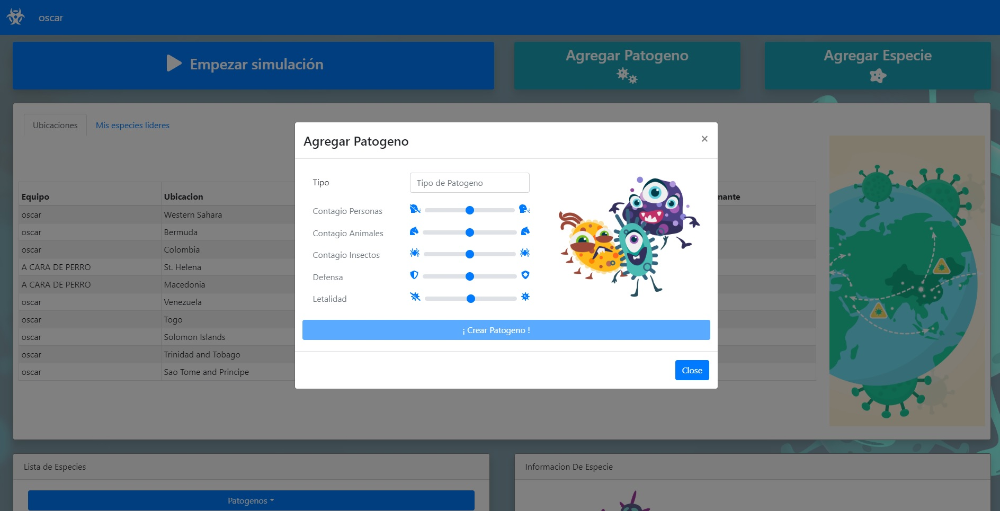
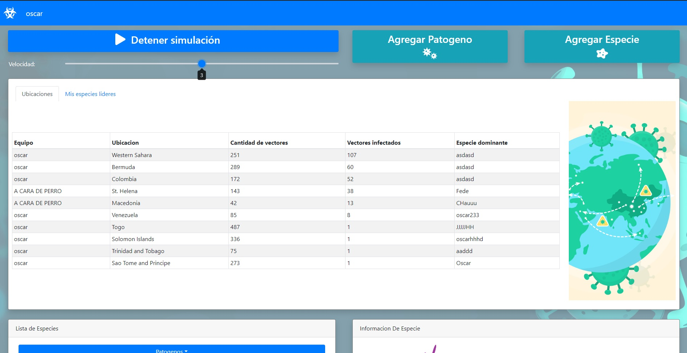
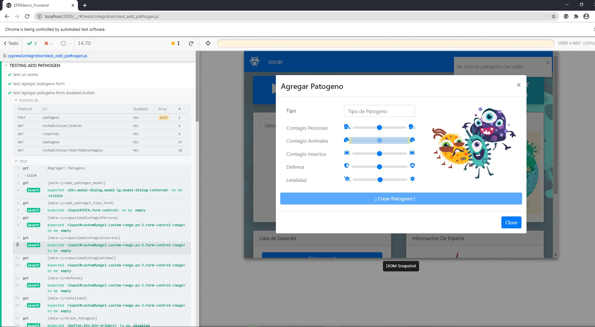
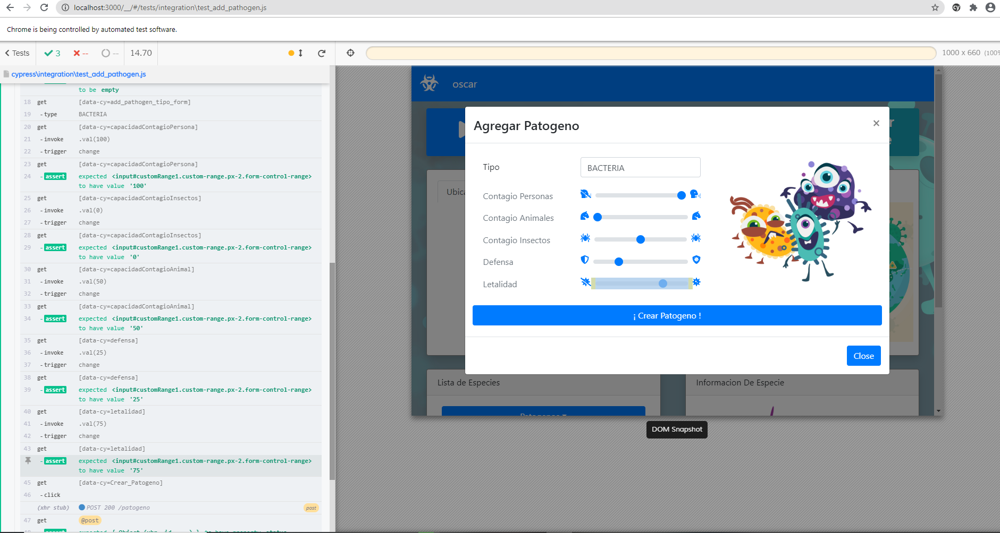
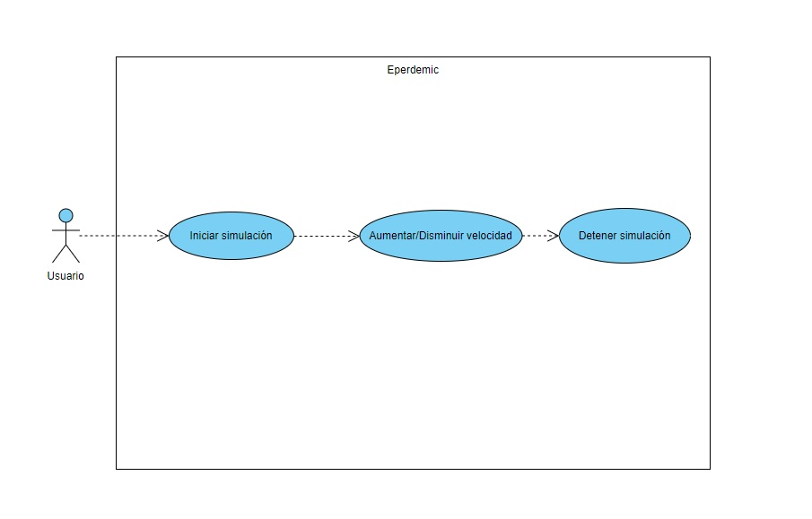

# Entrega 4

## Funcionalidades

Metas para la Entrega 4:

- Poder aumentar o disminuir la velocidad de la simulación.
- Agregar spinner de carga cuando no hay datos para mostrar.
- Creación de validaciones en modals de creación de patógenos y especies.
- Tests de frontend.

Como también fixeo de problemas:

- Agregar concurrencia al session factory.
- Que no vuelvan a cargar datos si ya estan cargados los datos de prueba.
- No hace falta levantar el backend 1ero, el frontend no rompe.

### Dificultades encontradas

- Para enviar pedidos de expansión al backend utilizamos una función de javascript que se llama "setInterval" la cual realiza una acción y la repite cada cierto tiempo provisto en milisegundos. Ese tiempo que se le da es fijo, no se puede cambiar sin cerrar el intervalo, por lo cual cuando quisimos implementar la funcionalidad de aumentar la velocidad nos encontramos con que dinámicamente modificar un intervalo no era posible. Había que manejar el comienzo y cierre de los intervalos cada vez que se modifica la velocidad.
Encontramos una solución en la cual pero parecía que utiliza bastantes recursos ya que ralentizaba toda la aplicación, no por decir que no se veía muy limpia, así que buscamos alternativas.
Al final la solución la encontramos en la vieja y confiable "librería externa", este es un problema recurrente y alguien ya desarrolló una herramienta que nos permite cambiar el delay del intervalo de forma dinámica fácilmente, así que por qué no usarlo?

- La librería externa que encontramos para manejar intervalos dinámicos rompe Cypress. No pudimos encontrar una solución a esta problemática a tiempo, pero entendemos que la solución es encontrar otra alternativa. Por el momento para correr cypress habrá que comentar la línea en la que se llama al método que utiliza el dynamic interval.

## Capa de presentacion Entrega 4 y Tests Frontend

  

  

  

  

## Casos de uso

  

`Como usuario quiero poder aumentar o disminuir la velocidad de la simulación.`
Al clickear en el botón de Iniciar simulación tenemos la posibilidad de modificar la velocidad de dicha simulación por medio de una slide.

