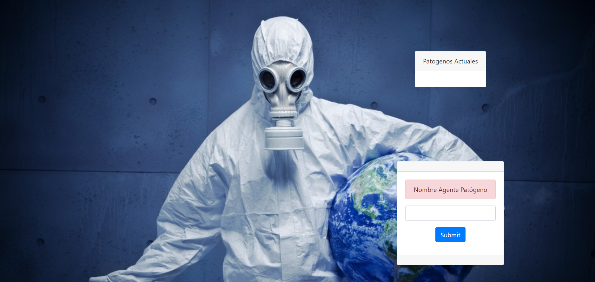

# Prueba de Concepto

## Funcionalidades

Como prueba de concepto decidimos realizar una pequeña demostración, la cual consistia en que mostrar la funcionalidad global de la aplicación.
Para eso tomamos como caso de uso la capacidad de crear un Patógeno (solo con el nombre) y la capacidad de poder ver todos los patógenos creados por todos los clientes.

Se consiguió lo propuesto siguiendo la arquitectura descrita en el home de esta wiki; muy resumido, la aplicación frontend dispara contra localhome para comunicarse con el servidor cliente
(el grupo de alumnos corriendo su TP) y mantiene comunicación con un servidor backend hosteado aparte con quien hace la conciliación de datos de todos los diferentes clientes locales.

## Capa de presentación en prueba de concepto

  

## Casos de uso

  

`Como Usuario quiero poder crear un agente patógeno.`

El usuario ingresa el nombre de un patógeno en un textbox, este se envía tanto al cliente del usuario como al backend externo.

`Como Usuario quiero poder recuperar todos los agentes patógenos y poder ver tanto los creados por mi, como los creados por los otros usuarios. `

La aplicación de frontend hace un pooling constante de los datos en el servidor backend, de tal forma de poder visualizar todos los patógenos creados.

